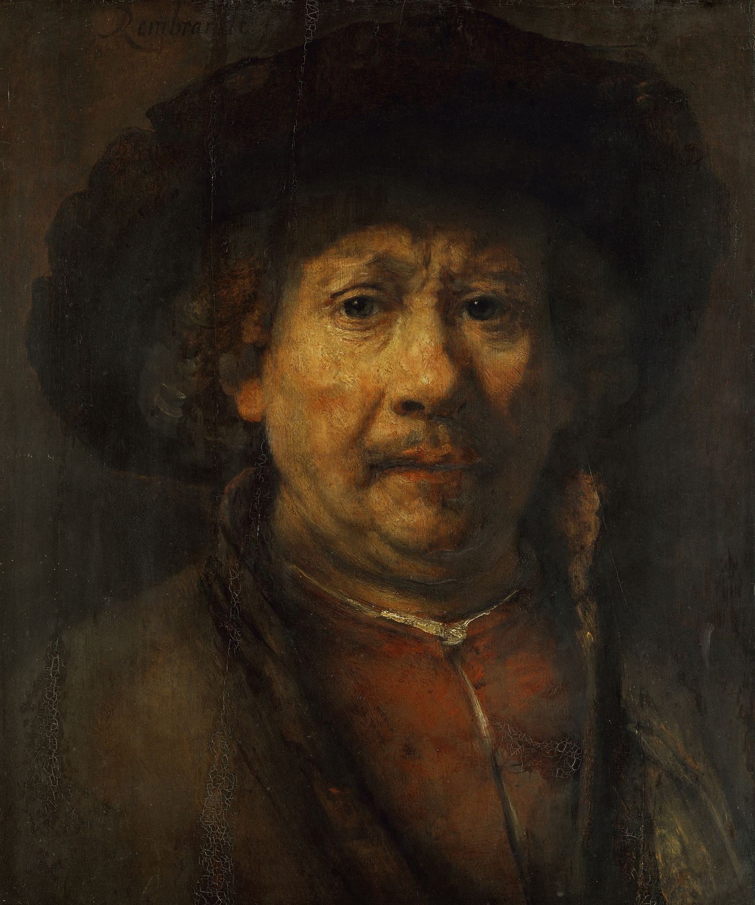

# rembrandt

## Overview

Rembrandt is a [Discord](https://discord.com/) bot that helps teach your server about art history and appreciation. It will periodically send the server random paintings, artifacts and sculptures within the [Metropolitan Museum of Art](https://www.metmuseum.org/) collection with accompanying information on the piece.

## Running the bot locally

### Prerequisites

To run the bot you'll need the following:

-   [nodejs](https://nodejs.org/en/) version 16+
-   [docker](https://www.docker.com/) and the [docker compose](https://docs.docker.com/compose/) plugin
-   [redis](https://redis.io/)
-   a [discord bot token](https://discord.com/developers) (see below)

### Creating a discord application and bot

When the "official" Rembrandt bot joins your server, it will be hosted and running via my own application with my own client keys and secrets. However, since those are private, you'll need one of your own to run the bot.

1. To do that, go to [Discord developer portal](https://discord.com/developers) and click the "new application" button. Give it any name you want (perhaps "Rembrandt"?) and then wait to be redirected to the application page.
2. Click the "bot" tab on the left and then click the "add bot" button
3. After you've given it a name and a description click the "reveal token" button (or copy token). **Treat this token like a password.** Don't store it anywhere, don't give it to anyone, etc.
4. Lastly, create a `.env` file in the root of the directory and add a line that looks like: `DISCORD_BOT_TOKEN=your_token_goes_here`. Make sure never to commit this file.

### Running the bot

First, run `npm install` to install the dependencies you need to run this project. Then proceed with either the running locally or runnning on a docker container steps.

#### On your machine

Run `npm run dev:watch` to start the bot in watch mode. This is useful for developing, but if you plan to not make any changes to the code, you can compile the code and then run the bot via `npm run build && npm run start`. The redis cache will also need to be started in order for the bot to function. Run `npm run start:redis` (this is a long running process, so run this in a new terminal window) to start the redis cache.

(Optional) If you prefer to have everything in a single console window, you can use [concurrently](https://www.npmjs.com/package/concurrently) to run both tasks at once. Install concurrently globally by running `npm install -g concurrently` and then run `concurrently \"npm run dev:watch\" \"npm run start:redis\"` (you can replace `npm run dev:watch` with `npm run build && npm run start` if you prefer the compile > run method).

Bot logs will be printed to the console.

#### Within a docker container

Run `docker compose up --build` within the root of the project to compose a new docker container from the `node:alpine` and `redis` images.

You can run `docker logs rembrandt-bot-1 -f` to see the logs for the bot.

## Commands

| Command    | Options            | Notes                                                                |
| ---------- | ------------------ | -------------------------------------------------------------------- |
| /art       | query (optional)   | Artwork will be picked at random unless a query is provided          |
| /subscribe | channel (required) | Must be a text channel. This signs your discord up for daily updates |

## Technologies

This bot is built with...

| Technology                            | Use                                                                              |
| ------------------------------------- | -------------------------------------------------------------------------------- |
| [Discord.js](https://discord.js.org/) | The bot SDK                                                                      |
| Redis                                 | Caching                                                                          |
| Typescript (& ts-node)                | A type-safe, compiled programming language that acts as a superset of Javascript |
| Jest (& ts-jest)                      | For testing                                                                      |
| Prettier                              | For code formatting                                                              |
| ESLint                                | Linting                                                                          |
| Axios                                 | Network requests                                                                 |

## Roadmap

| Feature                       | Status      | Notes                                                 |
| ----------------------------- | ----------- | ----------------------------------------------------- |
| Bot hosted                    | In progress | N/A                                                   |
| Daily artwork displays (push) | Not started | I want to complete the hosting of the bot before this |

## Notes

### Commit messages

All of the commit messages in this project are generated using [opencommit](https://github.com/di-sukharev/opencommit) which uses [OpenAI's GPT-4](https://openai.com/product/gpt-4) underneath the hood. I've found that for the most part these commit messages are spot on. However, there have been a few instances where the commit messages don't 100% line up with what is actually being changed. I'm okay with that considering that this is a personal project and I'll likely be the only contributor anyways.

The commit spec I'm using follows two conventions: [gitmoji](https://gitmoji.dev/) and [conventional commits](https://www.conventionalcommits.org/en/v1.0.0/).

### Missing images

For some reason, the [MET API](https://metmuseum.github.io/) includes artwork without images in their responses despite having a query parameter `hasImages=true` that tells it to do so. This causes some `/art` commands to be sent without embedded images.

### Query inaccuracy

This bot tends to be rather "fuzzy" when querying for art. There's two things that make it rather difficult at the moment to generate highly accurate searches:

1. The MET API just generally returns a ton of artwork for queries, even if it's only barely accurate. For example the query "birdhouse" will return birdhouses, birds, and houses; the query "waterfall" will return artwork depicting majestic waterfalls _and_ people falling from various structures.
2. The bot picks an image at random from the returned artwork. Even if the first few results are highly accurate, the bot will pick one at random in order to keep things interesting for the end user.

I have ways that I think I can improve this over time, but I intend to leave the querying/searching functionality somewhat fuzzy as I think it makes things more fun in the end.
